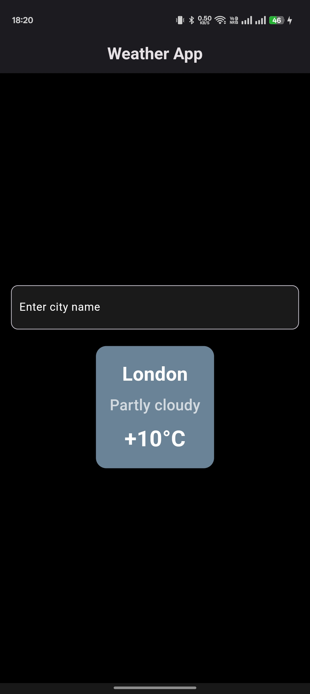
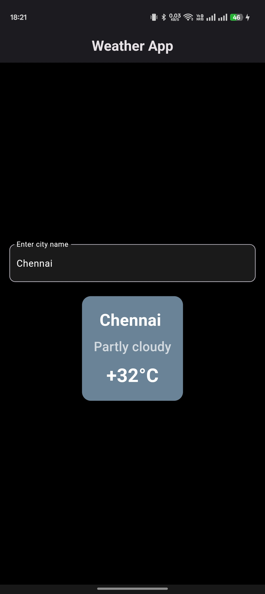
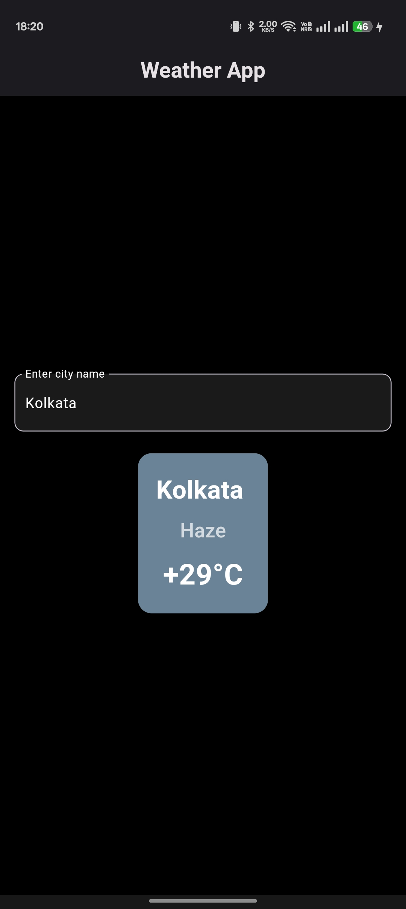
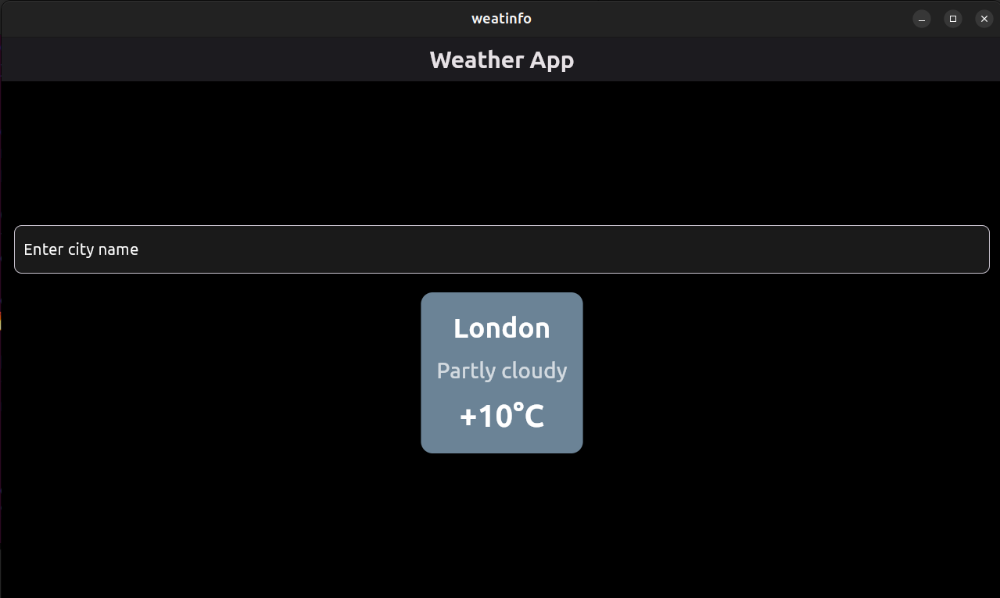
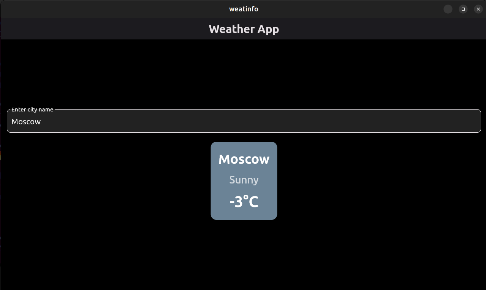

# Weather App

A simple Flutter application that fetches and displays weather data using [wttr.in](https://wttr.in). Users can enter a city name to get current weather conditions including temperature and weather description.

## Features
- Fetches real-time weather data from `wttr.in`
- Displays temperature, weather condition, and location
- Dark-themed UI with modern styling
- Search functionality to check weather for different cities

## Screenshots






## Installation

1. Clone the repository:
   ```sh
   git clone https://github.com/your-repo/flutter-weather-app.git
   cd flutter-weather-app
   ```

2. Install dependencies:
   ```sh
   flutter pub get
   ```

3. Run the app:
   ```sh
   flutter run
   ```

## Dependencies
- `flutter`
- `http` (for API requests)

## Usage
- Enter a city name in the text field and press enter
- View real-time weather data for the specified location

## Contribution
Feel free to contribute by opening issues or submitting pull requests!

## Author
- Your Name


